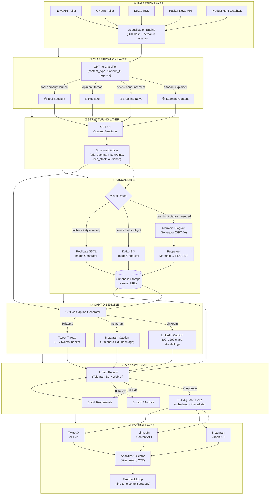

# Tech Content Creation Pipeline
### AI-Powered News-to-Social Automation with LangGraph

---

## Table of Contents

1. [System Overview](#1-system-overview)
2. [Full Architecture Diagram](#2-full-architecture-diagram)
3. [LangGraph Node Structure](#3-langgraph-node-structure)
4. [News Ingestion Layer](#4-news-ingestion-layer)
5. [Content Structuring & Intelligence](#5-content-structuring--intelligence)
6. [Visual & PDF Generation](#6-visual--pdf-generation)
7. [Caption & Copy Engine](#7-caption--copy-engine)
8. [Approval Gate](#8-approval-gate)
9. [Multi-Platform Posting](#9-multi-platform-posting)
10. [Project Structure & Setup](#10-project-structure--setup)
11. [Environment & Configuration](#11-environment--configuration)
12. [End-to-End Flow Example](#12-end-to-end-flow-example)
13. [API Reference Summary](#api-reference-summary)

---

## 1. System Overview

This pipeline transforms raw tech news into polished, platform-specific social content — fully automated from ingestion to posting, with a human-in-the-loop approval gate before anything goes live.

### Core Philosophy

```
Ingest → Deduplicate → Classify → Structure → Visualize → Caption → Approve → Post
```

**Technology Stack at a Glance**

| Layer            | Technology                                                          |
|------------------|---------------------------------------------------------------------|
| Orchestration    | LangGraph (StateGraph)                                              |
| LLM              | OpenAI GPT-4o                                                       |
| News Sources     | NewsAPI, GNews, Dev.to RSS, Hacker News API, Product Hunt GraphQL   |
| Image Generation | DALL-E 3, Replicate (SDXL)                                          |
| PDF / Diagram    | Puppeteer + Mermaid.js, PDFKit                                      |
| Approval Gate    | Telegram Bot / Web UI (Express.js)                                  |
| Social Posting   | LinkedIn API, Instagram Graph API, Twitter/X API v2                 |
| Queue            | BullMQ + Redis                                                      |
| Storage          | Supabase (articles + assets)                                        |
| Runtime          | Node.js 20 + TypeScript                                             |

---

## 2. Full Architecture Diagram



---

## 3. LangGraph Node Structure

### 3.1 State Schema

```typescript
// src/pipeline/state.ts
import { StateGraph, Annotation } from "@langchain/langgraph";

export const PipelineState = Annotation.Root({
  // --- Raw Input ---
  rawArticles: Annotation<RawArticle[]>({
    reducer: (prev, next) => [...prev, ...next],
    default: () => [],
  }),

  // --- After deduplication ---
  dedupedArticles: Annotation<RawArticle[]>({
    reducer: (_, next) => next,
    default: () => [],
  }),

  // --- Current article being processed ---
  currentArticle: Annotation<RawArticle | null>({
    reducer: (_, next) => next,
    default: () => null,
  }),

  // --- Classification ---
  contentType: Annotation<ContentType | null>({
    reducer: (_, next) => next,
    default: () => null,
  }),
  platformFit: Annotation<Platform[]>({
    reducer: (_, next) => next,
    default: () => [],
  }),
  urgencyScore: Annotation<number>({
    reducer: (_, next) => next,
    default: () => 0,
  }),

  // --- Structured Content ---
  structuredContent: Annotation<StructuredContent | null>({
    reducer: (_, next) => next,
    default: () => null,
  }),

  // --- Visuals ---
  mermaidCode: Annotation<string | null>({
    reducer: (_, next) => next,
    default: () => null,
  }),
  imageUrl: Annotation<string | null>({
    reducer: (_, next) => next,
    default: () => null,
  }),
  pdfUrl: Annotation<string | null>({
    reducer: (_, next) => next,
    default: () => null,
  }),

  // --- Captions ---
  captions: Annotation<PlatformCaptions | null>({
    reducer: (_, next) => next,
    default: () => null,
  }),

  // --- Approval ---
  approvalStatus: Annotation<"pending" | "approved" | "rejected" | "edit_requested">({
    reducer: (_, next) => next,
    default: () => "pending",
  }),
  approvalEdits: Annotation<Partial<PlatformCaptions> | null>({
    reducer: (_, next) => next,
    default: () => null,
  }),

  // --- Posting ---
  postResults: Annotation<PostResult[]>({
    reducer: (prev, next) => [...prev, ...next],
    default: () => [],
  }),

  // --- Errors ---
  errors: Annotation<PipelineError[]>({
    reducer: (prev, next) => [...prev, ...next],
    default: () => [],
  }),
});

export type ContentType = "tutorial" | "news" | "opinion" | "tool_spotlight" | "deep_dive";
export type Platform = "linkedin" | "instagram" | "twitter";

export interface RawArticle {
  id: string;
  url: string;
  title: string;
  description: string;
  content: string;
  source: string;
  publishedAt: string;
  urlHash: string;
}

export interface StructuredContent {
  title: string;
  hook: string;
  summary: string;
  keyPoints: string[];
  techStack: string[];
  targetAudience: string;
  diagramNeeded: boolean;
  diagramDescription?: string;
  imagePrompt: string;
  tone: "educational" | "conversational" | "hype" | "analytical";
}

export interface PlatformCaptions {
  linkedin: string;
  instagram: string;
  twitterThread: string[];
}

export interface PostResult {
  platform: Platform;
  postId: string;
  url: string;
  postedAt: string;
}

export interface PipelineError {
  node: string;
  message: string;
  timestamp: string;
}
```

### 3.2 Graph Definition

```typescript
// src/pipeline/graph.ts
import { StateGraph, END } from "@langchain/langgraph";
import { PipelineState } from "./state";

// Import nodes
import { ingestNode } from "./nodes/ingest";
import { deduplicateNode } from "./nodes/deduplicate";
import { classifyNode } from "./nodes/classify";
import { structureNode } from "./nodes/structure";
import { visualRouterNode } from "./nodes/visualRouter";
import { generateDiagramNode } from "./nodes/generateDiagram";
import { generateImageNode } from "./nodes/generateImage";
import { generateCaptionsNode } from "./nodes/generateCaptions";
import { approvalGateNode } from "./nodes/approvalGate";
import { applyEditsNode } from "./nodes/applyEdits";
import { postContentNode } from "./nodes/postContent";
import { analyticsNode } from "./nodes/analytics";

export function buildPipeline() {
  const graph = new StateGraph(PipelineState)

    // --- Nodes ---
    .addNode("ingest", ingestNode)
    .addNode("deduplicate", deduplicateNode)
    .addNode("classify", classifyNode)
    .addNode("structure", structureNode)
    .addNode("visualRouter", visualRouterNode)
    .addNode("generateDiagram", generateDiagramNode)
    .addNode("generateImage", generateImageNode)
    .addNode("generateCaptions", generateCaptionsNode)
    .addNode("approvalGate", approvalGateNode)
    .addNode("applyEdits", applyEditsNode)
    .addNode("postContent", postContentNode)
    .addNode("analytics", analyticsNode)

    // --- Entry ---
    .setEntryPoint("ingest")

    // --- Linear flow ---
    .addEdge("ingest", "deduplicate")
    .addEdge("deduplicate", "classify")
    .addEdge("classify", "structure")
    .addEdge("structure", "visualRouter")

    // --- Visual routing conditional ---
    .addConditionalEdges("visualRouter", routeVisuals, {
      diagram: "generateDiagram",
      image: "generateImage",
    })

    // Both visual paths converge at captions
    .addEdge("generateDiagram", "generateCaptions")
    .addEdge("generateImage", "generateCaptions")
    .addEdge("generateCaptions", "approvalGate")

    // --- Approval gate conditional ---
    .addConditionalEdges("approvalGate", routeApproval, {
      approved: "postContent",
      edit_requested: "applyEdits",
      rejected: END,
    })

    .addEdge("applyEdits", "approvalGate")   // Loop back for re-review
    .addEdge("postContent", "analytics")
    .addEdge("analytics", END);

  return graph.compile();
}

// Conditional routing functions
function routeVisuals(state: typeof PipelineState.State) {
  const { structuredContent } = state;
  if (structuredContent?.diagramNeeded) return "diagram";
  return "image";
}

function routeApproval(state: typeof PipelineState.State) {
  return state.approvalStatus === "approved"
    ? "approved"
    : state.approvalStatus === "edit_requested"
    ? "edit_requested"
    : "rejected";
}
```

### 3.3 Node Implementations

#### Ingest Node

```typescript
// src/pipeline/nodes/ingest.ts
import { PipelineState } from "../state";
import { NewsAPIClient } from "../../integrations/newsapi";
import { GNewsClient } from "../../integrations/gnews";
import { DevToRSSClient } from "../../integrations/devto";
import { HackerNewsClient } from "../../integrations/hackernews";
import { ProductHuntClient } from "../../integrations/producthunt";
import { createHash } from "crypto";

export async function ingestNode(
  state: typeof PipelineState.State
): Promise<Partial<typeof PipelineState.State>> {
  const sources = await Promise.allSettled([
    new NewsAPIClient().fetchTechNews({ pageSize: 20 }),
    new GNewsClient().fetchTechNews({ max: 10 }),
    new DevToRSSClient().fetchLatest({ limit: 15 }),
    new HackerNewsClient().fetchTopStories({ limit: 20 }),
    new ProductHuntClient().fetchTodaysPosts({ limit: 10 }),
  ]);

  const rawArticles = sources
    .filter((r): r is PromiseFulfilledResult<RawArticle[]> => r.status === "fulfilled")
    .flatMap((r) => r.value)
    .map((article) => ({
      ...article,
      urlHash: createHash("md5").update(article.url).digest("hex"),
    }));

  return { rawArticles };
}
```

#### Classify Node

```typescript
// src/pipeline/nodes/classify.ts
import OpenAI from "openai";
import { PipelineState } from "../state";

const openai = new OpenAI({ apiKey: process.env.OPENAI_API_KEY });

export async function classifyNode(
  state: typeof PipelineState.State
): Promise<Partial<typeof PipelineState.State>> {
  const { currentArticle } = state;
  if (!currentArticle) return {};

  const response = await openai.chat.completions.create({
    model: "gpt-4o",
    response_format: { type: "json_object" },
    messages: [
      {
        role: "system",
        content: `You are a tech content classifier. Analyze the article and return JSON with:
- content_type: "tutorial" | "news" | "opinion" | "tool_spotlight" | "deep_dive"
- platform_fit: array of "linkedin" | "instagram" | "twitter" (1-3 platforms)
- urgency_score: 0-10 (10 = breaking news, 0 = evergreen)
- reasoning: one sentence explaining the classification`,
      },
      {
        role: "user",
        content: `Title: ${currentArticle.title}\n\nDescription: ${currentArticle.description}\n\nContent: ${currentArticle.content?.slice(0, 2000)}`,
      },
    ],
  });

  const parsed = JSON.parse(response.choices[0].message.content!);

  return {
    contentType: parsed.content_type,
    platformFit: parsed.platform_fit,
    urgencyScore: parsed.urgency_score,
  };
}
```

#### Structure Node

```typescript
// src/pipeline/nodes/structure.ts
import OpenAI from "openai";
import { PipelineState, StructuredContent } from "../state";

const openai = new OpenAI({ apiKey: process.env.OPENAI_API_KEY });

const STRUCTURE_PROMPTS: Record<string, string> = {
  tutorial: `Structure this as a learning guide. Include: hook (why this matters), 
    summary (2-3 sentences), keyPoints (5-7 actionable steps), techStack (frameworks/tools used), 
    diagramNeeded: true, diagramDescription (what the diagram should show), imagePrompt`,
    
  news: `Structure this as breaking tech news. Include: hook (the headline moment), 
    summary (5W1H in 2 sentences), keyPoints (3-5 impact bullets), techStack, 
    diagramNeeded: false, imagePrompt (dramatic tech visual)`,
    
  tool_spotlight: `Structure this as a product spotlight. Include: hook (problem it solves), 
    summary (what it does + who it's for), keyPoints (top features), techStack, 
    diagramNeeded: false, imagePrompt (clean product visual)`,

  opinion: `Structure this as a hot take. Include: hook (the controversial claim), 
    summary (the argument), keyPoints (supporting evidence), techStack (if relevant),
    diagramNeeded: false, imagePrompt`,

  deep_dive: `Structure this as a technical deep dive. Include: hook, detailed summary, 
    keyPoints (7-10 technical insights), techStack, diagramNeeded: true, 
    diagramDescription (architecture or flow diagram), imagePrompt`,
};

export async function structureNode(
  state: typeof PipelineState.State
): Promise<Partial<typeof PipelineState.State>> {
  const { currentArticle, contentType } = state;
  if (!currentArticle || !contentType) return {};

  const prompt = STRUCTURE_PROMPTS[contentType] || STRUCTURE_PROMPTS.news;

  const response = await openai.chat.completions.create({
    model: "gpt-4o",
    response_format: { type: "json_object" },
    messages: [
      {
        role: "system",
        content: `You are a tech content strategist. ${prompt}
        Return valid JSON matching the StructuredContent schema. 
        tone must be one of: educational | conversational | hype | analytical`,
      },
      {
        role: "user",
        content: `Article:\nTitle: ${currentArticle.title}\nContent: ${currentArticle.content?.slice(0, 4000)}`,
      },
    ],
  });

  const structuredContent: StructuredContent = JSON.parse(
    response.choices[0].message.content!
  );

  return { structuredContent };
}
```

#### Generate Diagram Node (Mermaid → PDF/PNG)

```typescript
// src/pipeline/nodes/generateDiagram.ts
import OpenAI from "openai";
import puppeteer from "puppeteer";
import { PipelineState } from "../state";
import { uploadToSupabase } from "../../storage/supabase";

const openai = new OpenAI({ apiKey: process.env.OPENAI_API_KEY });

export async function generateDiagramNode(
  state: typeof PipelineState.State
): Promise<Partial<typeof PipelineState.State>> {
  const { structuredContent, contentType } = state;
  if (!structuredContent?.diagramNeeded) return {};

  // Step 1: GPT-4o generates Mermaid code
  const mermaidResponse = await openai.chat.completions.create({
    model: "gpt-4o",
    messages: [
      {
        role: "system",
        content: `Generate a valid Mermaid diagram for a tech social post.
Rules:
- Use flowchart TD or sequenceDiagram based on content
- Maximum 12 nodes (must be readable on mobile)
- Use clear, concise labels (no jargon)
- Return ONLY the raw Mermaid code, no markdown fences`,
      },
      {
        role: "user",
        content: `Diagram for: ${structuredContent.diagramDescription}
Key points: ${structuredContent.keyPoints.join(", ")}`,
      },
    ],
  });

  const mermaidCode = mermaidResponse.choices[0].message.content!.trim();

  // Step 2: Render with Puppeteer
  const { pngBuffer, pdfBuffer } = await renderMermaidWithPuppeteer(mermaidCode);

  // Step 3: Upload to Supabase Storage
  const [imageUrl, pdfUrl] = await Promise.all([
    uploadToSupabase(pngBuffer, `diagrams/${Date.now()}.png`, "image/png"),
    uploadToSupabase(pdfBuffer, `pdfs/${Date.now()}.pdf`, "application/pdf"),
  ]);

  return { mermaidCode, imageUrl, pdfUrl };
}

async function renderMermaidWithPuppeteer(mermaidCode: string) {
  const browser = await puppeteer.launch({ args: ["--no-sandbox"] });
  const page = await browser.newPage();

  await page.setContent(`
    <!DOCTYPE html>
    <html>
    <head>
      <script src="https://cdn.jsdelivr.net/npm/mermaid/dist/mermaid.min.js"></script>
      <style>
        body { margin: 0; background: #0f172a; display: flex; justify-content: center; padding: 40px; }
        .mermaid { max-width: 900px; }
        .mermaid svg { background: #1e293b !important; border-radius: 12px; padding: 24px; }
      </style>
    </head>
    <body>
      <div class="mermaid">${mermaidCode}</div>
      <script>
        mermaid.initialize({ 
          theme: 'dark',
          themeVariables: { primaryColor: '#6366f1', primaryTextColor: '#e2e8f0' }
        });
      </script>
    </body>
    </html>
  `);

  await page.waitForSelector(".mermaid svg");

  const pngBuffer = await page.screenshot({ type: "png", fullPage: false });
  const pdfBuffer = await page.pdf({ format: "A4", printBackground: true });

  await browser.close();
  return { pngBuffer, pdfBuffer };
}
```

#### Generate Image Node (DALL-E + Replicate fallback)

```typescript
// src/pipeline/nodes/generateImage.ts
import OpenAI from "openai";
import Replicate from "replicate";
import { PipelineState } from "../state";
import { uploadToSupabase } from "../../storage/supabase";

const openai = new OpenAI({ apiKey: process.env.OPENAI_API_KEY });
const replicate = new Replicate({ auth: process.env.REPLICATE_API_TOKEN });

export async function generateImageNode(
  state: typeof PipelineState.State
): Promise<Partial<typeof PipelineState.State>> {
  const { structuredContent, contentType } = state;
  if (!structuredContent) return {};

  const enhancedPrompt = buildImagePrompt(structuredContent.imagePrompt, contentType!);

  try {
    // Try DALL-E 3 first
    const response = await openai.images.generate({
      model: "dall-e-3",
      prompt: enhancedPrompt,
      n: 1,
      size: "1024x1024",
      quality: "hd",
      style: "vivid",
    });

    const imageUrl = response.data[0].url!;
    return { imageUrl };
  } catch (dalleError) {
    console.warn("DALL-E failed, falling back to Replicate SDXL:", dalleError);

    // Fallback to Replicate SDXL
    const output = await replicate.run("stability-ai/sdxl:latest", {
      input: {
        prompt: enhancedPrompt,
        negative_prompt: "blurry, watermark, text overlay, ugly, amateur",
        width: 1024,
        height: 1024,
        num_outputs: 1,
        scheduler: "DPMSolverMultistep",
        num_inference_steps: 40,
        guidance_scale: 7.5,
      },
    }) as string[];

    const imageUrl = await uploadToSupabase(
      await fetch(output[0]).then((r) => r.arrayBuffer()),
      `images/${Date.now()}.png`,
      "image/png"
    );

    return { imageUrl };
  }
}

function buildImagePrompt(basePrompt: string, contentType: string): string {
  const styleMap: Record<string, string> = {
    news: "photorealistic, dramatic lighting, tech newsroom aesthetic, dark background, neon accents",
    tutorial: "clean infographic style, flat design, dark mode, purple and blue gradients, minimal",
    tool_spotlight: "product showcase, sleek UI screenshot style, gradient background, modern",
    opinion: "bold typography composition, abstract geometric, high contrast, editorial",
    deep_dive: "technical blueprint aesthetic, circuit board details, dark theme, glowing highlights",
  };

  return `${basePrompt}. ${styleMap[contentType] || styleMap.news}. Professional tech social media post. 4K, sharp focus.`;
}
```

#### Captions Node

```typescript
// src/pipeline/nodes/generateCaptions.ts
import OpenAI from "openai";
import { PipelineState, PlatformCaptions } from "../state";

const openai = new OpenAI({ apiKey: process.env.OPENAI_API_KEY });

export async function generateCaptionsNode(
  state: typeof PipelineState.State
): Promise<Partial<typeof PipelineState.State>> {
  const { structuredContent, contentType, platformFit } = state;
  if (!structuredContent) return {};

  const [linkedin, instagram, twitterThread] = await Promise.all([
    platformFit.includes("linkedin") ? generateLinkedInCaption(structuredContent, contentType!) : Promise.resolve(""),
    platformFit.includes("instagram") ? generateInstagramCaption(structuredContent) : Promise.resolve(""),
    platformFit.includes("twitter") ? generateTwitterThread(structuredContent, contentType!) : Promise.resolve([]),
  ]);

  return {
    captions: {
      linkedin: linkedin as string,
      instagram: instagram as string,
      twitterThread: twitterThread as string[],
    },
  };
}

async function generateLinkedInCaption(content: any, contentType: string): Promise<string> {
  const response = await openai.chat.completions.create({
    model: "gpt-4o",
    messages: [
      {
        role: "system",
        content: `Write a LinkedIn post for a tech professional audience.
Rules:
- 800-1200 characters
- Start with a bold hook (no "I" as first word)
- Use 2-3 line breaks between paragraphs
- End with a thought-provoking question
- Include 3-5 relevant hashtags at the end
- Tone: ${contentType === "tutorial" ? "educational and authoritative" : "conversational and insightful"}
- NO emojis overload — max 3 strategic emojis`,
      },
      {
        role: "user",
        content: `Title: ${content.title}
Hook: ${content.hook}
Key Points: ${content.keyPoints.join("\n")}
Audience: ${content.targetAudience}`,
      },
    ],
  });

  return response.choices[0].message.content!;
}

async function generateInstagramCaption(content: any): Promise<string> {
  const response = await openai.chat.completions.create({
    model: "gpt-4o",
    messages: [
      {
        role: "system",
        content: `Write an Instagram caption for a tech audience.
Rules:
- First 125 chars must be punchy (shown before "more")
- Total: 150-200 chars of actual content
- Followed by a blank line
- Then 25-30 hashtags (mix of broad and niche tech hashtags)
- Use relevant emojis naturally (3-5)`,
      },
      {
        role: "user",
        content: `Title: ${content.title}\nSummary: ${content.summary}\nTech Stack: ${content.techStack.join(", ")}`,
      },
    ],
  });

  return response.choices[0].message.content!;
}

async function generateTwitterThread(content: any, contentType: string): Promise<string[]> {
  const response = await openai.chat.completions.create({
    model: "gpt-4o",
    response_format: { type: "json_object" },
    messages: [
      {
        role: "system",
        content: `Write a Twitter/X thread for a tech audience. Return JSON: { "tweets": string[] }
Rules:
- 5-7 tweets
- Tweet 1: Hook with numbers or bold claim (max 240 chars)
- Tweets 2-6: One key insight each, numbered (2/, 3/, etc.)
- Final tweet: CTA or reflection question
- Each tweet max 240 characters
- Conversational, not corporate`,
      },
      {
        role: "user",
        content: `Title: ${content.title}\nKey Points: ${content.keyPoints.join("\n")}\nHook: ${content.hook}`,
      },
    ],
  });

  const parsed = JSON.parse(response.choices[0].message.content!);
  return parsed.tweets;
}
```

---

## 4. News Ingestion Layer

The pipeline pulls from five sources in parallel using `Promise.allSettled`, so a single failing source never blocks the run. Each client normalises its response into the shared `RawArticle` schema and appends a URL hash used by the deduplication step.

### 4.1 NewsAPI Integration

```typescript
// src/integrations/newsapi.ts
export class NewsAPIClient {
  private baseUrl = "https://newsapi.org/v2";

  async fetchTechNews(opts: { pageSize: number; from?: string }) {
    const params = new URLSearchParams({
      q: "artificial intelligence OR LLM OR developer tools OR open source",
      language: "en",
      sortBy: "publishedAt",
      pageSize: String(opts.pageSize),
      from: opts.from || new Date(Date.now() - 86400000).toISOString(),
      apiKey: process.env.NEWSAPI_KEY!,
    });

    const res = await fetch(`${this.baseUrl}/everything?${params}`);
    const data = await res.json();
    return data.articles.map(this.normalize);
  }

  private normalize(article: any): RawArticle {
    return {
      id: article.url,
      url: article.url,
      title: article.title,
      description: article.description,
      content: article.content,
      source: `NewsAPI:${article.source.name}`,
      publishedAt: article.publishedAt,
      urlHash: "",
    };
  }
}
```

### 4.2 Dev.to RSS Feed

```typescript
// src/integrations/devto.ts
import Parser from "rss-parser";

export class DevToRSSClient {
  private parser = new Parser();

  async fetchLatest(opts: { limit: number; tag?: string }) {
    const tag = opts.tag || "javascript,typescript,ai,devtools";
    const feed = await this.parser.parseURL(
      `https://dev.to/feed/tag/${tag.split(",")[0]}`
    );

    return feed.items.slice(0, opts.limit).map((item) => ({
      id: item.link!,
      url: item.link!,
      title: item.title!,
      description: item.contentSnippet || "",
      content: item.content || item.contentSnippet || "",
      source: "dev.to",
      publishedAt: item.pubDate || new Date().toISOString(),
      urlHash: "",
    }));
  }
}
```

### 4.3 Hacker News API

```typescript
// src/integrations/hackernews.ts
export class HackerNewsClient {
  private baseUrl = "https://hacker-news.firebaseio.com/v0";

  async fetchTopStories(opts: { limit: number }) {
    const storyIds: number[] = await fetch(`${this.baseUrl}/topstories.json`)
      .then((r) => r.json());

    const stories = await Promise.all(
      storyIds.slice(0, opts.limit).map((id) =>
        fetch(`${this.baseUrl}/item/${id}.json`).then((r) => r.json())
      )
    );

    return stories
      .filter((s) => s.url && s.score > 100) // Filter by quality
      .map((s) => ({
        id: String(s.id),
        url: s.url,
        title: s.title,
        description: s.title, // HN doesn't have descriptions
        content: s.text || s.title,
        source: "Hacker News",
        publishedAt: new Date(s.time * 1000).toISOString(),
        urlHash: "",
      }));
  }
}
```

### 4.4 Product Hunt GraphQL

```typescript
// src/integrations/producthunt.ts
export class ProductHuntClient {
  private endpoint = "https://api.producthunt.com/v2/api/graphql";

  async fetchTodaysPosts(opts: { limit: number }) {
    const query = `
      query {
        posts(first: ${opts.limit}, order: VOTES) {
          edges {
            node {
              id name tagline description
              url votesCount
              topics { edges { node { name } } }
            }
          }
        }
      }
    `;

    const res = await fetch(this.endpoint, {
      method: "POST",
      headers: {
        "Content-Type": "application/json",
        Authorization: `Bearer ${process.env.PRODUCTHUNT_TOKEN}`,
      },
      body: JSON.stringify({ query }),
    });

    const { data } = await res.json();
    return data.posts.edges.map(({ node }: any) => ({
      id: node.id,
      url: node.url,
      title: node.name,
      description: node.tagline,
      content: node.description,
      source: "Product Hunt",
      publishedAt: new Date().toISOString(),
      urlHash: "",
    }));
  }
}
```

---

## 5. Content Structuring & Intelligence

### 5.1 Deduplication Engine

```typescript
// src/pipeline/nodes/deduplicate.ts
import { createHash } from "crypto";
import { supabase } from "../../storage/supabase";
import OpenAI from "openai";

const openai = new OpenAI({ apiKey: process.env.OPENAI_API_KEY });

export async function deduplicateNode(
  state: typeof PipelineState.State
): Promise<Partial<typeof PipelineState.State>> {
  const { rawArticles } = state;

  // Step 1: URL hash deduplication (exact)
  const existingHashes = await supabase
    .from("processed_articles")
    .select("url_hash")
    .in("url_hash", rawArticles.map((a) => a.urlHash));

  const seenHashes = new Set(existingHashes.data?.map((r) => r.url_hash));
  const urlDeduped = rawArticles.filter((a) => !seenHashes.has(a.urlHash));

  // Step 2: Semantic deduplication via embeddings (catches rephrased duplicates)
  const embeddings = await openai.embeddings.create({
    model: "text-embedding-3-small",
    input: urlDeduped.map((a) => `${a.title} ${a.description}`),
  });

  const uniqueArticles = filterBySimilarity(
    urlDeduped,
    embeddings.data.map((e) => e.embedding),
    0.92 // similarity threshold
  );

  return { dedupedArticles: uniqueArticles };
}

function filterBySimilarity(
  articles: RawArticle[],
  embeddings: number[][],
  threshold: number
): RawArticle[] {
  const kept: number[] = [];

  for (let i = 0; i < articles.length; i++) {
    const isDuplicate = kept.some((j) => {
      const similarity = cosineSimilarity(embeddings[i], embeddings[j]);
      return similarity > threshold;
    });
    if (!isDuplicate) kept.push(i);
  }

  return kept.map((i) => articles[i]);
}

function cosineSimilarity(a: number[], b: number[]): number {
  const dot = a.reduce((sum, val, i) => sum + val * b[i], 0);
  const magA = Math.sqrt(a.reduce((sum, val) => sum + val * val, 0));
  const magB = Math.sqrt(b.reduce((sum, val) => sum + val * val, 0));
  return dot / (magA * magB);
}
```

---

## 6. Visual & PDF Generation

### 6.1 PDF Generation with PDFKit (Learning Content)

```typescript
// src/generators/pdfkit-generator.ts
import PDFDocument from "pdfkit";
import { uploadToSupabase } from "../storage/supabase";

export async function generateLearningPDF(content: StructuredContent, imageBuffer?: Buffer): Promise<string> {
  const doc = new PDFDocument({
    size: "A4",
    margin: 50,
    info: { Title: content.title, Author: "TechPipeline Bot" },
  });

  const buffers: Buffer[] = [];
  doc.on("data", (chunk) => buffers.push(chunk));

  // --- Header ---
  doc
    .rect(0, 0, doc.page.width, 120)
    .fill("#0f172a")
    .fillColor("#6366f1")
    .font("Helvetica-Bold")
    .fontSize(24)
    .text(content.title, 50, 35, { width: doc.page.width - 100 })
    .fillColor("#94a3b8")
    .fontSize(12)
    .font("Helvetica")
    .text(`For: ${content.targetAudience}`, 50, 90);

  doc.moveDown(4);

  // --- Hook ---
  doc
    .fillColor("#1e293b")
    .rect(50, doc.y, doc.page.width - 100, 60)
    .fill()
    .fillColor("#e2e8f0")
    .font("Helvetica-Bold")
    .fontSize(14)
    .text(`💡 ${content.hook}`, 65, doc.y - 50, { width: doc.page.width - 130 });

  doc.moveDown(2);

  // --- Summary ---
  doc
    .fillColor("#334155")
    .font("Helvetica")
    .fontSize(12)
    .text(content.summary, { lineGap: 4 });

  doc.moveDown(1.5);

  // --- Key Points ---
  doc.fillColor("#6366f1").font("Helvetica-Bold").fontSize(16).text("Key Takeaways");
  doc.moveDown(0.5);

  content.keyPoints.forEach((point, i) => {
    doc
      .fillColor("#1e293b")
      .circle(60, doc.y + 6, 8)
      .fill()
      .fillColor("#ffffff")
      .font("Helvetica-Bold")
      .fontSize(9)
      .text(String(i + 1), 57, doc.y - 10)
      .fillColor("#334155")
      .font("Helvetica")
      .fontSize(12)
      .text(point, 80, doc.y - 20, { width: doc.page.width - 130, lineGap: 2 });
    doc.moveDown(0.8);
  });

  // --- Tech Stack chips ---
  if (content.techStack.length > 0) {
    doc.moveDown(1);
    doc.fillColor("#6366f1").font("Helvetica-Bold").fontSize(14).text("Tech Stack");
    doc.moveDown(0.5);

    let x = 50;
    content.techStack.forEach((tech) => {
      const width = doc.widthOfString(tech) + 20;
      doc.rect(x, doc.y, width, 24).fill("#1e293b");
      doc.fillColor("#a5b4fc").font("Helvetica").fontSize(11).text(tech, x + 10, doc.y - 18);
      x += width + 8;
      if (x > 450) { x = 50; doc.moveDown(1.8); }
    });
  }

  // --- Diagram image (if provided) ---
  if (imageBuffer) {
    doc.addPage();
    doc.fillColor("#6366f1").font("Helvetica-Bold").fontSize(16).text("Architecture Diagram");
    doc.moveDown(1);
    doc.image(imageBuffer, { width: 500, align: "center" });
  }

  doc.end();

  await new Promise<void>((resolve) => doc.on("end", resolve));
  const pdfBuffer = Buffer.concat(buffers);

  return uploadToSupabase(pdfBuffer, `pdfs/${Date.now()}-${content.title.slice(0, 20)}.pdf`, "application/pdf");
}
```

---

## 7. Caption & Copy Engine

### 7.1 Platform-Specific Formatting Rules

| Platform   | Length                        | Format                              | Hashtags              | Emojis      |
|------------|-------------------------------|-------------------------------------|-----------------------|-------------|
| LinkedIn   | 800–1,200 chars               | Storytelling → insight → question   | 3–5 at end            | Max 3       |
| Instagram  | 125 chars visible + hashtags  | Hook → body → CTA                   | 25–30 after blank line | 3–5 natural |
| Twitter/X  | 5–7 tweets × 240 chars        | Hook → numbered insights → CTA      | 1–2 per tweet         | Occasional  |

### 7.2 Apply Edits Node (Post-Approval Refinement)

```typescript
// src/pipeline/nodes/applyEdits.ts
import OpenAI from "openai";
import { PipelineState } from "../state";

const openai = new OpenAI({ apiKey: process.env.OPENAI_API_KEY });

export async function applyEditsNode(
  state: typeof PipelineState.State
): Promise<Partial<typeof PipelineState.State>> {
  const { captions, approvalEdits } = state;
  if (!captions || !approvalEdits) return {};

  const updatedCaptions = { ...captions };

  // Apply manual edits directly if provided
  if (approvalEdits.linkedin) updatedCaptions.linkedin = approvalEdits.linkedin;
  if (approvalEdits.instagram) updatedCaptions.instagram = approvalEdits.instagram;
  if (approvalEdits.twitterThread) updatedCaptions.twitterThread = approvalEdits.twitterThread;

  // If edit instructions were text (not replacement), use GPT to apply
  if (typeof approvalEdits === "string") {
    const response = await openai.chat.completions.create({
      model: "gpt-4o",
      response_format: { type: "json_object" },
      messages: [
        {
          role: "system",
          content: "Apply the requested edits to the captions. Return JSON with the same structure.",
        },
        {
          role: "user",
          content: `Current captions: ${JSON.stringify(captions)}\n\nRequested changes: ${approvalEdits}`,
        },
      ],
    });
    return {
      captions: JSON.parse(response.choices[0].message.content!),
      approvalStatus: "pending",
    };
  }

  return { captions: updatedCaptions, approvalStatus: "pending" };
}
```

---

## 8. Approval Gate

### 8.1 Telegram Bot Approval (Recommended)

```typescript
// src/approval/telegram-bot.ts
import TelegramBot from "node-telegram-bot-api";
import { EventEmitter } from "events";

const bot = new TelegramBot(process.env.TELEGRAM_BOT_TOKEN!, { polling: true });
const approvalEmitter = new EventEmitter();

export class TelegramApprovalGate {
  private chatId = process.env.TELEGRAM_CHAT_ID!;

  async requestApproval(payload: ApprovalPayload): Promise<ApprovalDecision> {
    const { captions, imageUrl, article } = payload;

    // Send preview card
    await bot.sendPhoto(this.chatId, imageUrl, {
      caption: `📋 *New Content for Review*\n\n*Source:* ${article.source}\n*Title:* ${article.title}`,
      parse_mode: "Markdown",
    });

    // Send captions preview
    await bot.sendMessage(
      this.chatId,
      `*LinkedIn Preview:*\n${captions.linkedin.slice(0, 400)}...\n\n*Instagram:*\n${captions.instagram.slice(0, 200)}\n\n*Tweet 1:*\n${captions.twitterThread[0]}`,
      { parse_mode: "Markdown" }
    );

    // Send action keyboard
    const { message_id } = await bot.sendMessage(this.chatId, "What would you like to do?", {
      reply_markup: {
        inline_keyboard: [
          [
            { text: "✅ Approve & Post", callback_data: `approve_${payload.id}` },
            { text: "❌ Reject", callback_data: `reject_${payload.id}` },
          ],
          [
            { text: "✏️ Edit LinkedIn", callback_data: `edit_li_${payload.id}` },
            { text: "✏️ Edit Instagram", callback_data: `edit_ig_${payload.id}` },
            { text: "✏️ Edit Tweet", callback_data: `edit_tw_${payload.id}` },
          ],
          [{ text: "⏰ Schedule for Later", callback_data: `schedule_${payload.id}` }],
        ],
      },
    });

    // Wait for callback
    return new Promise((resolve) => {
      bot.on("callback_query", async (query) => {
        const data = query.data!;
        if (!data.endsWith(payload.id)) return;

        await bot.answerCallbackQuery(query.id);

        if (data.startsWith("approve")) {
          resolve({ status: "approved" });
        } else if (data.startsWith("reject")) {
          resolve({ status: "rejected" });
        } else if (data.startsWith("edit_")) {
          const platform = data.split("_")[1];
          await bot.sendMessage(this.chatId, `Send me the updated ${platform} caption:`);
          bot.once("message", (msg) => {
            resolve({
              status: "edit_requested",
              edits: { [platform]: msg.text },
            });
          });
        } else if (data.startsWith("schedule")) {
          await bot.sendMessage(this.chatId, "Send schedule time (e.g. 'tomorrow 9am IST'):");
          bot.once("message", (msg) => {
            resolve({ status: "approved", scheduleTime: msg.text });
          });
        }
      });
    });
  }
}

export interface ApprovalPayload {
  id: string;
  article: RawArticle;
  captions: PlatformCaptions;
  imageUrl: string;
}

export interface ApprovalDecision {
  status: "approved" | "rejected" | "edit_requested";
  edits?: Partial<PlatformCaptions>;
  scheduleTime?: string;
}
```

### 8.2 Approval Gate Node

```typescript
// src/pipeline/nodes/approvalGate.ts
import { PipelineState } from "../state";
import { TelegramApprovalGate } from "../../approval/telegram-bot";

const gate = new TelegramApprovalGate();

export async function approvalGateNode(
  state: typeof PipelineState.State
): Promise<Partial<typeof PipelineState.State>> {
  const { captions, imageUrl, currentArticle } = state;
  if (!captions || !currentArticle) return {};

  const decision = await gate.requestApproval({
    id: currentArticle.urlHash,
    article: currentArticle,
    captions,
    imageUrl: imageUrl!,
  });

  return {
    approvalStatus: decision.status as any,
    approvalEdits: decision.edits ?? null,
  };
}
```

---

## 9. Multi-Platform Posting

Each platform poster is an isolated class. Jobs are enqueued via BullMQ and executed by a separate worker process, keeping the main pipeline non-blocking. All three posters return a `PostResult` that the analytics node stores in Supabase.

### 9.1 LinkedIn Content API

```typescript
// src/posting/linkedin.ts
export class LinkedInPoster {
  private baseUrl = "https://api.linkedin.com/v2";

  async post(caption: string, imageUrl?: string): Promise<PostResult> {
    const accessToken = process.env.LINKEDIN_ACCESS_TOKEN!;
    const personId = process.env.LINKEDIN_PERSON_ID!;

    let mediaAsset: string | undefined;

    // Upload image first if provided
    if (imageUrl) {
      mediaAsset = await this.uploadImage(imageUrl, accessToken, personId);
    }

    const body: any = {
      author: `urn:li:person:${personId}`,
      lifecycleState: "PUBLISHED",
      specificContent: {
        "com.linkedin.ugc.ShareContent": {
          shareCommentary: { text: caption },
          shareMediaCategory: mediaAsset ? "IMAGE" : "NONE",
          ...(mediaAsset && {
            media: [{
              status: "READY",
              media: mediaAsset,
            }],
          }),
        },
      },
      visibility: { "com.linkedin.ugc.MemberNetworkVisibility": "PUBLIC" },
    };

    const res = await fetch(`${this.baseUrl}/ugcPosts`, {
      method: "POST",
      headers: {
        Authorization: `Bearer ${accessToken}`,
        "Content-Type": "application/json",
        "X-Restli-Protocol-Version": "2.0.0",
      },
      body: JSON.stringify(body),
    });

    const data = await res.json();
    return {
      platform: "linkedin",
      postId: data.id,
      url: `https://www.linkedin.com/feed/update/${data.id}`,
      postedAt: new Date().toISOString(),
    };
  }

  private async uploadImage(imageUrl: string, token: string, personId: string): Promise<string> {
    // Step 1: Register upload
    const registerRes = await fetch(`${this.baseUrl}/assets?action=registerUpload`, {
      method: "POST",
      headers: { Authorization: `Bearer ${token}`, "Content-Type": "application/json" },
      body: JSON.stringify({
        registerUploadRequest: {
          recipes: ["urn:li:digitalmediaRecipe:feedshare-image"],
          owner: `urn:li:person:${personId}`,
          serviceRelationships: [{ relationshipType: "OWNER", identifier: "urn:li:userGeneratedContent" }],
        },
      }),
    });

    const { value } = await registerRes.json();
    const uploadUrl = value.uploadMechanism["com.linkedin.digitalmedia.uploading.MediaUploadHttpRequest"].uploadUrl;
    const asset = value.asset;

    // Step 2: Upload binary
    const imageBuffer = await fetch(imageUrl).then((r) => r.arrayBuffer());
    await fetch(uploadUrl, { method: "PUT", body: imageBuffer });

    return asset;
  }
}
```

### 9.2 Instagram Graph API

```typescript
// src/posting/instagram.ts
export class InstagramPoster {
  private baseUrl = "https://graph.facebook.com/v19.0";
  private igUserId = process.env.INSTAGRAM_USER_ID!;
  private accessToken = process.env.INSTAGRAM_ACCESS_TOKEN!;

  async post(caption: string, imageUrl: string): Promise<PostResult> {
    // Step 1: Create media container
    const containerRes = await fetch(`${this.baseUrl}/${this.igUserId}/media`, {
      method: "POST",
      headers: { "Content-Type": "application/json" },
      body: JSON.stringify({
        image_url: imageUrl,
        caption,
        access_token: this.accessToken,
      }),
    });

    const { id: containerId } = await containerRes.json();

    // Step 2: Wait for processing
    await this.waitForContainer(containerId);

    // Step 3: Publish
    const publishRes = await fetch(`${this.baseUrl}/${this.igUserId}/media_publish`, {
      method: "POST",
      headers: { "Content-Type": "application/json" },
      body: JSON.stringify({ creation_id: containerId, access_token: this.accessToken }),
    });

    const { id: postId } = await publishRes.json();
    return {
      platform: "instagram",
      postId,
      url: `https://www.instagram.com/p/${postId}`,
      postedAt: new Date().toISOString(),
    };
  }

  private async waitForContainer(containerId: string, maxAttempts = 10): Promise<void> {
    for (let i = 0; i < maxAttempts; i++) {
      const res = await fetch(
        `${this.baseUrl}/${containerId}?fields=status_code&access_token=${this.accessToken}`
      );
      const { status_code } = await res.json();
      if (status_code === "FINISHED") return;
      await new Promise((r) => setTimeout(r, 3000));
    }
    throw new Error("Instagram media container did not finish processing");
  }
}
```

### 9.3 Twitter/X API v2 (Thread Poster)

```typescript
// src/posting/twitter.ts
import { TwitterApi } from "twitter-api-v2";

export class TwitterPoster {
  private client: TwitterApi;

  constructor() {
    this.client = new TwitterApi({
      appKey: process.env.TWITTER_API_KEY!,
      appSecret: process.env.TWITTER_API_SECRET!,
      accessToken: process.env.TWITTER_ACCESS_TOKEN!,
      accessSecret: process.env.TWITTER_ACCESS_SECRET!,
    });
  }

  async postThread(tweets: string[], imageUrl?: string): Promise<PostResult> {
    let previousTweetId: string | undefined;
    let firstTweetId: string | undefined;

    for (let i = 0; i < tweets.length; i++) {
      const params: any = { text: tweets[i] };

      // Attach image to first tweet
      if (i === 0 && imageUrl) {
        const mediaId = await this.uploadMedia(imageUrl);
        params.media = { media_ids: [mediaId] };
      }

      // Chain tweets into a thread
      if (previousTweetId) {
        params.reply = { in_reply_to_tweet_id: previousTweetId };
      }

      const { data } = await this.client.v2.tweet(params);
      if (i === 0) firstTweetId = data.id;
      previousTweetId = data.id;

      // Small delay to preserve thread order
      if (i < tweets.length - 1) await new Promise((r) => setTimeout(r, 1500));
    }

    return {
      platform: "twitter",
      postId: firstTweetId!,
      url: `https://twitter.com/i/web/status/${firstTweetId}`,
      postedAt: new Date().toISOString(),
    };
  }

  private async uploadMedia(imageUrl: string): Promise<string> {
    const buffer = Buffer.from(await fetch(imageUrl).then((r) => r.arrayBuffer()));
    return this.client.v1.uploadMedia(buffer, { mimeType: "image/png" });
  }
}
```

### 9.4 Post Content Node (BullMQ Queue)

```typescript
// src/pipeline/nodes/postContent.ts
import { Queue } from "bullmq";
import IORedis from "ioredis";
import { PipelineState } from "../state";

const connection = new IORedis(process.env.REDIS_URL!);
const postQueue = new Queue("social-posts", { connection });

export async function postContentNode(
  state: typeof PipelineState.State
): Promise<Partial<typeof PipelineState.State>> {
  const { captions, imageUrl, pdfUrl, platformFit, approvalStatus } = state;

  if (approvalStatus !== "approved" || !captions) return {};

  const jobs = platformFit.map((platform) => ({
    name: `post-${platform}`,
    data: {
      platform,
      caption: platform === "twitter" ? captions.twitterThread : captions[platform],
      imageUrl,
      pdfUrl: platform === "linkedin" ? pdfUrl : undefined,
    },
    opts: { attempts: 3, backoff: { type: "exponential", delay: 5000 } },
  }));

  await postQueue.addBulk(jobs);

  return {}; // Worker processes the queue separately
}
```

---

## 10. Project Structure & Setup

```
tech-content-pipeline/
├── src/
│   ├── pipeline/
│   │   ├── graph.ts              ← LangGraph StateGraph definition
│   │   ├── state.ts              ← State schema & type definitions
│   │   └── nodes/
│   │       ├── ingest.ts
│   │       ├── deduplicate.ts
│   │       ├── classify.ts
│   │       ├── structure.ts
│   │       ├── visualRouter.ts
│   │       ├── generateDiagram.ts
│   │       ├── generateImage.ts
│   │       ├── generateCaptions.ts
│   │       ├── approvalGate.ts
│   │       ├── applyEdits.ts
│   │       ├── postContent.ts
│   │       └── analytics.ts
│   ├── integrations/
│   │   ├── newsapi.ts
│   │   ├── gnews.ts
│   │   ├── devto.ts
│   │   ├── hackernews.ts
│   │   └── producthunt.ts
│   ├── generators/
│   │   ├── pdfkit-generator.ts
│   │   └── mermaid-puppeteer.ts
│   ├── posting/
│   │   ├── linkedin.ts
│   │   ├── instagram.ts
│   │   └── twitter.ts
│   ├── approval/
│   │   └── telegram-bot.ts
│   ├── storage/
│   │   └── supabase.ts
│   ├── workers/
│   │   └── post-worker.ts        ← BullMQ worker process
│   └── index.ts                  ← Pipeline entry point & scheduler
├── .env
├── package.json
└── tsconfig.json
```

### Installation

```bash
# Initialize project
mkdir tech-content-pipeline && cd tech-content-pipeline
npm init -y

# Core orchestration
npm install @langchain/langgraph @langchain/core openai

# News ingestion
npm install rss-parser

# Image generation
npm install replicate

# PDF & diagram generation
npm install pdfkit puppeteer

# Social posting
npm install twitter-api-v2

# Approval bot
npm install node-telegram-bot-api

# Queue & storage
npm install bullmq ioredis @supabase/supabase-js

# Utilities
npm install -D typescript @types/node ts-node nodemon dotenv
```

---

## 11. Environment & Configuration

```bash
# .env

# === LLM ===
OPENAI_API_KEY=sk-...

# === News APIs ===
NEWSAPI_KEY=your_newsapi_key
GNEWS_API_KEY=your_gnews_key
PRODUCTHUNT_TOKEN=your_ph_developer_token

# === Image Generation ===
REPLICATE_API_TOKEN=r8_...

# === Storage ===
SUPABASE_URL=https://xxxx.supabase.co
SUPABASE_SERVICE_KEY=eyJh...

# === Approval ===
TELEGRAM_BOT_TOKEN=123456:ABC...
TELEGRAM_CHAT_ID=your_personal_chat_id

# === LinkedIn ===
LINKEDIN_ACCESS_TOKEN=AQX...
LINKEDIN_PERSON_ID=xxxxxxx

# === Instagram ===
INSTAGRAM_USER_ID=17841...
INSTAGRAM_ACCESS_TOKEN=EAAx...

# === Twitter/X ===
TWITTER_API_KEY=xxx
TWITTER_API_SECRET=xxx
TWITTER_ACCESS_TOKEN=xxx
TWITTER_ACCESS_SECRET=xxx

# === Queue ===
REDIS_URL=redis://localhost:6379

# === Pipeline Config ===
PIPELINE_CRON="0 8,12,17 * * *"   # Run at 8am, noon, 5pm
MAX_ARTICLES_PER_RUN=5
MIN_URGENCY_SCORE=3
```

### Pipeline Entry Point with Scheduler

```typescript
// src/index.ts
import cron from "node-cron";
import { buildPipeline } from "./pipeline/graph";

const pipeline = buildPipeline();

async function runPipeline() {
  console.log(`[${new Date().toISOString()}] Starting pipeline run...`);

  const result = await pipeline.invoke({
    rawArticles: [],
    dedupedArticles: [],
    currentArticle: null,
    // ... (all state defaults)
  });

  console.log(`Pipeline complete. Posted: ${result.postResults.length} items`);
}

// Run on schedule
cron.schedule(process.env.PIPELINE_CRON || "0 8,12,17 * * *", runPipeline);

// Also support immediate run
if (process.argv.includes("--now")) runPipeline();
```

---

## 12. End-to-End Flow Example

Here's a complete trace for a typical article going through the pipeline:

```
[08:00:00] INGEST: Fetching from 5 sources...
           → NewsAPI: 20 articles
           → GNews: 10 articles  
           → Dev.to: 15 articles
           → Hacker News: 18 articles (score > 100)
           → Product Hunt: 10 posts
           Total: 73 raw articles

[08:00:08] DEDUPLICATE:
           → URL hash filter: 12 already processed → 61 unique
           → Semantic similarity (threshold 0.92): 8 near-duplicates removed
           → 53 novel articles queued for processing

[08:00:10] CLASSIFY (article: "OpenAI releases o3-mini with 99.5% on AIME benchmark"):
           → content_type: "news"
           → platform_fit: ["linkedin", "twitter"]
           → urgency_score: 9

[08:00:12] STRUCTURE:
           → title: "OpenAI's o3-mini Just Changed the Math on AI Reasoning"
           → hook: "A model just scored 99.5% on a benchmark PhD students fail."
           → keyPoints: [5 bullet points]
           → diagramNeeded: false
           → imagePrompt: "Futuristic AI brain solving complex mathematical equations..."

[08:00:18] VISUAL ROUTER → generateImage (no diagram needed)

[08:00:35] IMAGE GENERATED via DALL-E 3:
           → Uploaded to Supabase: https://xxx.supabase.co/storage/images/1234.png

[08:00:42] CAPTIONS GENERATED:
           → LinkedIn: 1,087 chars, 4 hashtags
           → Twitter thread: 6 tweets

[08:00:42] APPROVAL GATE:
           → Telegram notification sent with image preview + captions
           → Waiting for human decision...

[08:01:15] HUMAN APPROVED ✅ (with LinkedIn edit: changed opening line)

[08:01:15] APPLY EDITS: LinkedIn caption updated

[08:01:16] POST QUEUE: 2 jobs added (linkedin, twitter)

[08:01:20] POSTED TO LINKEDIN: urn:li:ugcPost:7234...
[08:01:25] POSTED TO TWITTER: Thread of 6 tweets, first ID: 18234...

[08:01:30] ANALYTICS: Post IDs saved to Supabase for tracking
```

---

## API Reference Summary

Quick reference for every external integration used in the pipeline, including auth methods and rate limits to keep in mind during development and production operation.

| Integration       | Endpoint / SDK                           | Auth Method          | Rate Limit            |
|-------------------|------------------------------------------|----------------------|-----------------------|
| NewsAPI           | `newsapi.org/v2/everything`              | API Key (header)     | 100 req/day (free)    |
| GNews             | `gnews.io/api/v4/search`                 | API Key (param)      | 100 req/day (free)    |
| Dev.to RSS        | `dev.to/feed/tag/{tag}`                  | None                 | Generous              |
| Hacker News       | `hacker-news.firebaseio.com/v0`          | None                 | No limit              |
| Product Hunt      | GraphQL endpoint                         | OAuth2 Bearer        | 1,000 req/hr          |
| OpenAI GPT-4o     | `api.openai.com/v1/chat/completions`     | API Key              | Tier-based            |
| DALL-E 3          | `api.openai.com/v1/images/generations`   | API Key              | 5 img/min (tier 1)    |
| Replicate         | SDK                                      | API Token            | Pay-per-run           |
| LinkedIn UGC      | `api.linkedin.com/v2/ugcPosts`           | OAuth2 Bearer        | 100 req/day           |
| Instagram Graph   | `graph.facebook.com/v19.0`               | User Access Token    | 200 calls/hr          |
| Twitter v2        | `api.twitter.com/2/tweets`               | OAuth 1.0a           | 17 tweets/15 min      |
| Telegram Bot      | `api.telegram.org/bot{token}`            | Bot Token            | 30 msg/sec            |

---

*Built for Aryan's personal brand automation stack — combining agentic orchestration with human oversight to maintain authenticity at scale.*